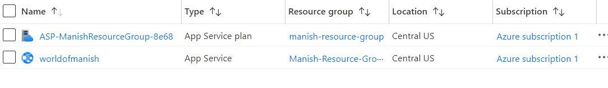
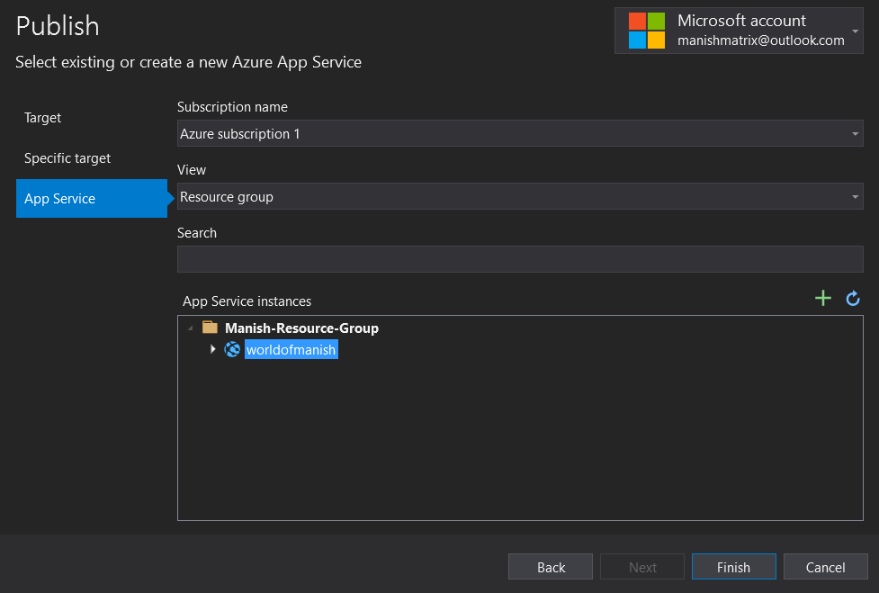
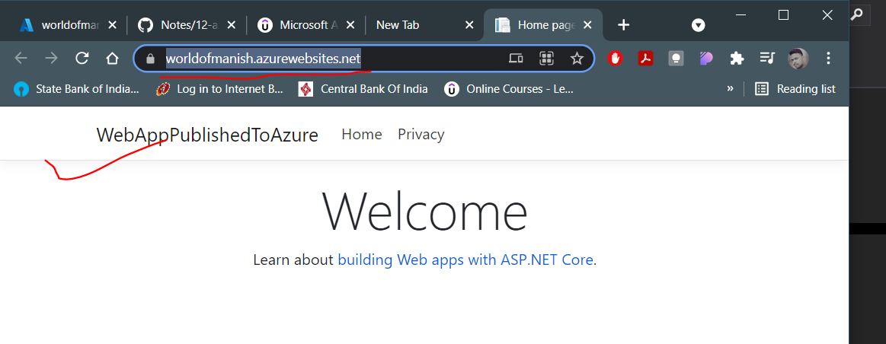

# Azure App service

- It is a platform as a Service offering
- You don't have to maintain the underlying compute infrastructure
- It has features such as autoscalling and security
- It has devops capabilities which includes continuous deployment

## Azure app service plan pricing

Please refer the [link](https://azure.microsoft.com/en-in/pricing/details/app-service/windows/)

## Creating a Azure Web app

Search Azure web app -> Click on create -> select resource group and give a unique name -> give runtime stack -> select OS -> Windows -> select region -> (Important, as this step will decide billing) Sku and size, choose basic for minimal billing -> disable application insights -> review and create, once created it will be available at the unique name.azuresites.net

**Note**: This will create two resources as shown below:

Now you can create a .net core project in Azure and then publish it to you web app you just created.

Right click on the project in solution explorer-> click on publish-> select target as Azure -> Azure App Service(Windows, because that what we created web app service instance in our azure portal)-> based on your subscription, the visual studio will show the app services instances, in our case it was shown as below:

Click on finish and wait and click on `Publish`

Once done refresh the app service instance url again.

