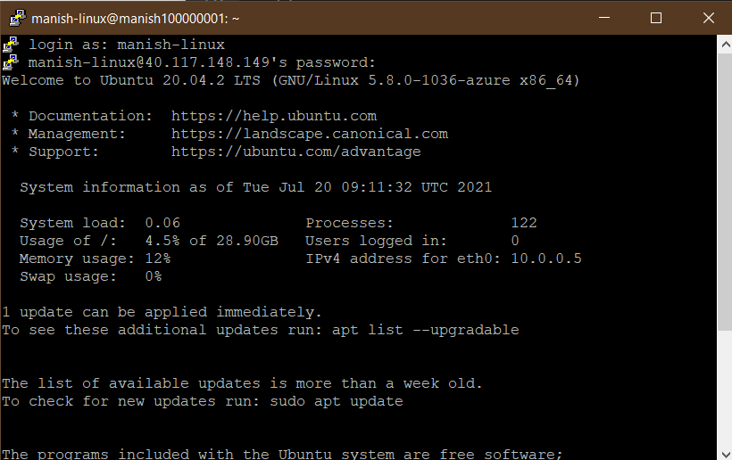
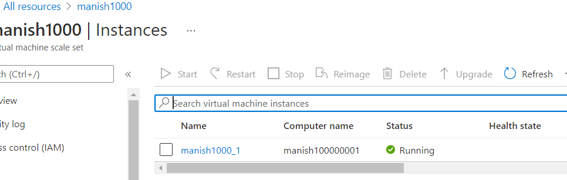
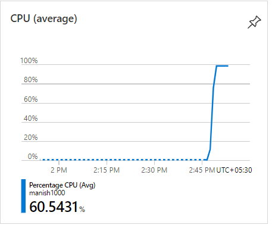
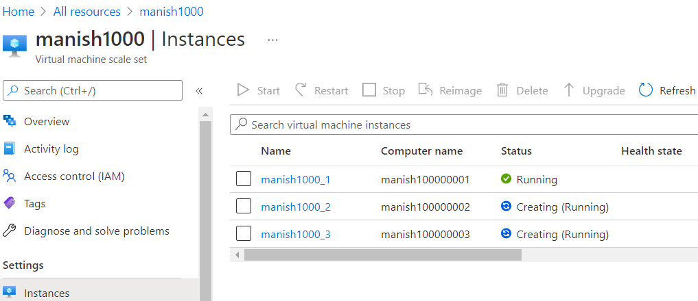
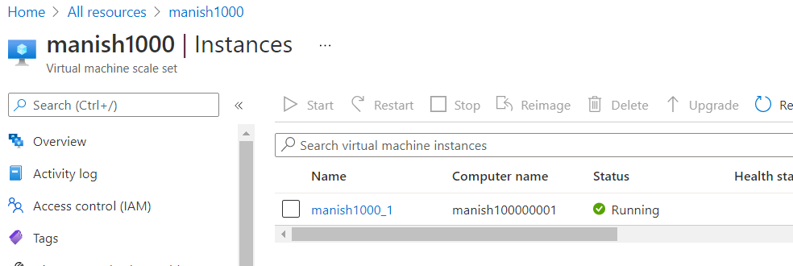

# Why Azure VM Scale Sets

For an application if resource demand needs to scale, i.e. if the CPU is almost 90 % and we keep increasing the cpu cores, there is limited to what we can increase up / scale up. in such scenario we may have to scale out, i.e. create more VMs similar to the existing one on demand to distribute the load.
We should be doing this automatically as the demand increases, and that's where scale sets come in.

We define a scale set in Azure by defining the initial size of the scale set. you can also define various conditions like if cpu usage goes beyond 60%, automatically create a new VM.

**Note**: The Azure scale set will add a new VM when required, but it is you duty to define which type of VM and what workload it is supporting to ensure the new VM solves the issue by scaling out.

**Note**: We can also add conditions to scale in the VMs, in order to ensure optimatimal cost for resource.

## Working with scale set (example)

In this example we will create a Azure scale set with one VM, the we will ssh into that VM and stress its cpu to reach more that 90%. In our scale set, we will have a condition to scale out upto maximum 3 machines, if the cpu usage is above 75% for a duration of say 5 minutes. That means after 5 minutes of stress, the scale should ensure there are 3 VMs running for us instead of the 1 VM as it was in the beginning.

Creating scaleset is similar to creating any other Azure resource. when you create ensure, minimal cost options are selected.

In the beginning:

setting up scalling policy:

Once the scale set is create, you will have one VM deployed for you. SSH into the VM using Putty and then update its packages, then run the stress creating program as shown below:

Created instance in the beginning using Scale set:

Get the public ip of the new initial VM, and SSH into it using putty, i.e. give the public ip in putty and login using the username and password created during scale set creation:

Update the packages on this Vm using `sudo apt-get update`
Install the stress program by issuing the command `sudo apt-get install -y stress`

Issue command for inducing stree on cpu to 90% `sudo stress --cpu 90`

beginging of 10 minutes, we see one instance:

If we go to Scaleset resource-> overview and monitoring, we see:

What we are expecting after 10 minutes is that we have the maximum number of VM allowed in the scale set.

And we get the below results:

When you stop the stress program, the azure scale set will scale in the VMs and finally you will see that only one VM is running as per our initial configuration

