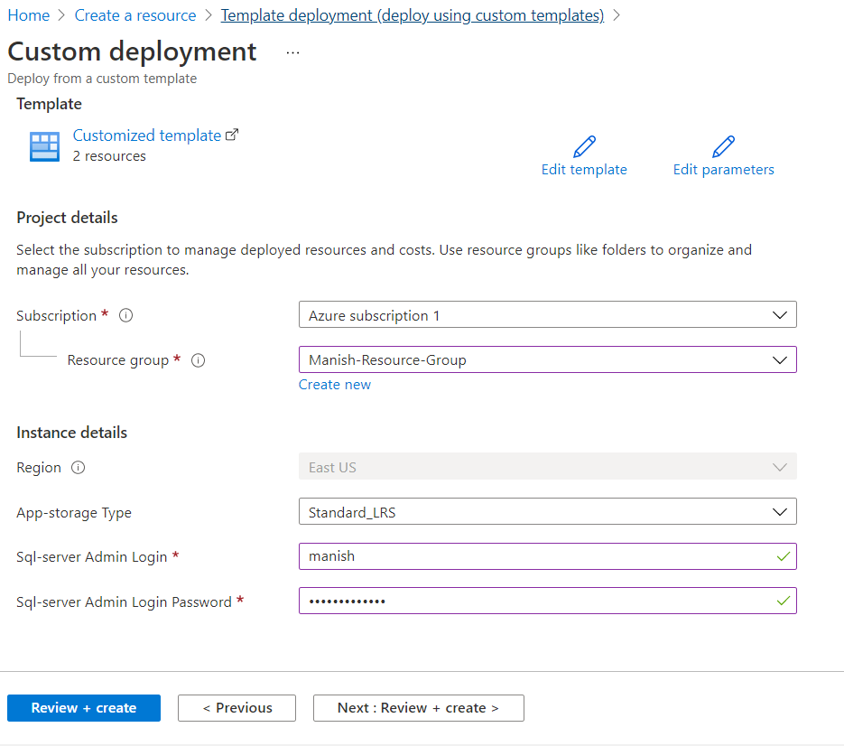

# Azure Resource Manager (ARM) Templates

- Using ARM templates, you can easily deploy your underlying infrastructure using infrastructure as code
- This can then help to automate repetitive deployments
- Lets say your company needs a test environment of 3 VMs, an Azure web app and an Azure web app and Azure sql database instance
- lets say this environment is used every week. And then after a week it needs to be rebuilt from scratch
- Doing this via the portal or via scripts can be a tedious task
- Using ARM templates, which is nothing but a JSON file helps to overcome obstacles when implementing such scenarios.

## The ARM template consists of the following

- Parameters: This helps to make the template more dynamic in nature. Here you can provide values during the deployment of the template.
- Variables: These are values that can be reused in the template.
- User-defined functions: You create your own customized functions
- Resources: This is where you specify the resources that are going to be deployed via this template.
- Output: These are values that get returned from the deployed resources.

## Creating a ARM Template

Create resource -> Template deployment (deploy using custom templates) -> Create

You can select any available common template, or you can build your own template.
**Note:** You can either type out the JSON yourself or you can use the `Add resource` button at the top left.
Using the above option will ensure error free templates and and will also take care of declare parameter to be supplied before deploying the templates along with variables.

**Note:** Below ARM templates creates an azure resource and a sql server instance

```JSON
{
    "$schema": "https://schema.management.azure.com/schemas/2019-04-01/deploymentTemplate.json#",
    "contentVersion": "1.0.0.0",
    "parameters": {
        "app-storageType": {
            "type": "string",
            "defaultValue": "Standard_LRS",
            "allowedValues": [
                "Standard_LRS",
                "Standard_ZRS",
                "Standard_GRS",
                "Standard_RAGRS",
                "Premium_LRS"
            ]
        },
        "sql-serverAdminLogin": {
            "type": "string",
            "minLength": 1
        },
        "sql-serverAdminLoginPassword": {
            "type": "securestring"
        }
    },
    "resources": [
        {
            "name": "[variables('app-storageName')]",
            "type": "Microsoft.Storage/storageAccounts",
            "location": "[resourceGroup().location]",
            "apiVersion": "2015-06-15",
            "dependsOn": [],
            "tags": {
                "displayName": "app-storage"
            },
            "properties": {
                "accountType": "[parameters('app-storageType')]"
            }
        },
        {
            "name": "[variables('sql-serverName')]",
            "type": "Microsoft.Sql/servers",
            "location": "[resourceGroup().location]",
            "apiVersion": "2014-04-01-preview",
            "dependsOn": [],
            "tags": {
                "displayName": "sql-server"
            },
            "properties": {
                "administratorLogin": "[parameters('sql-serverAdminLogin')]",
                "administratorLoginPassword": "[parameters('sql-serverAdminLoginPassword')]"
            },
            "resources": [
                {
                    "name": "AllowAllWindowsAzureIps",
                    "type": "firewallrules",
                    "location": "[resourceGroup().location]",
                    "apiVersion": "2014-04-01-preview",
                    "dependsOn": [
                        "[concat('Microsoft.Sql/servers/', variables('sql-serverName'))]"
                    ],
                    "properties": {
                        "startIpAddress": "0.0.0.0",
                        "endIpAddress": "0.0.0.0"
                    }
                }
            ]
        }
    ],
    "variables": {
        "app-storageName": "[concat('app-storage', uniqueString(resourceGroup().id))]",
        "sql-serverName": "[concat('sql-server', uniqueString(resourceGroup().id))]"
    }
}
```

And below the screen where is asks us to select necessary parameters for the scripts and resource groups:

