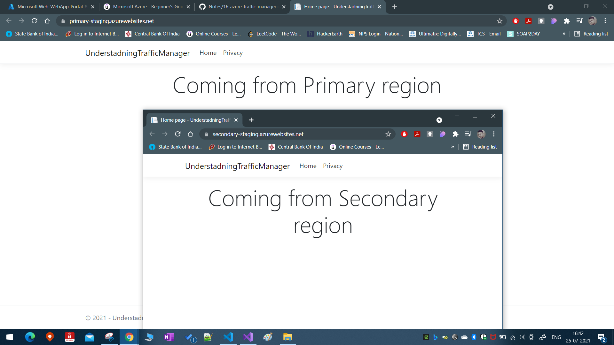
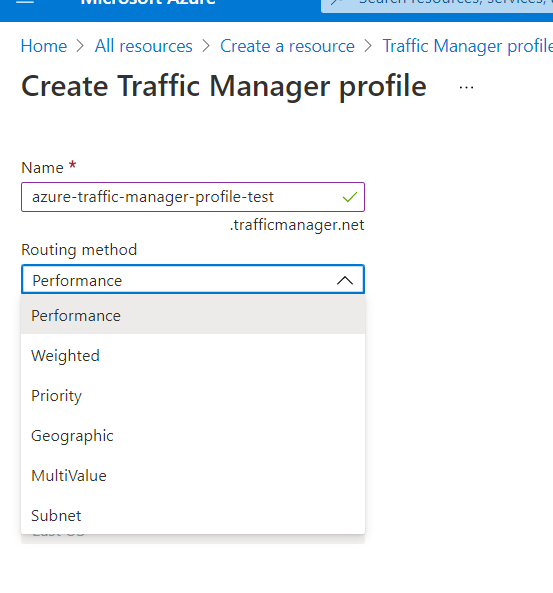
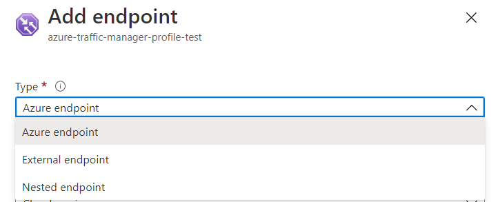
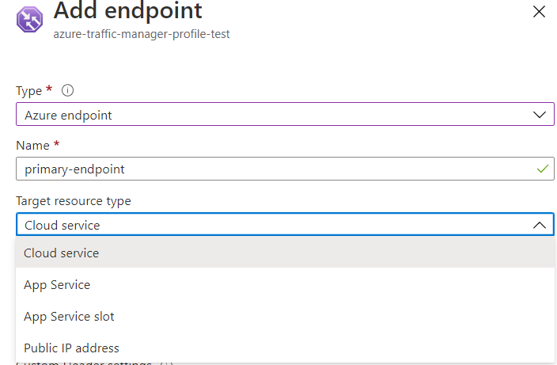
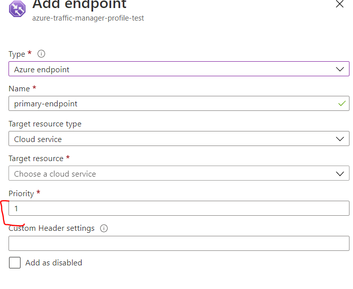
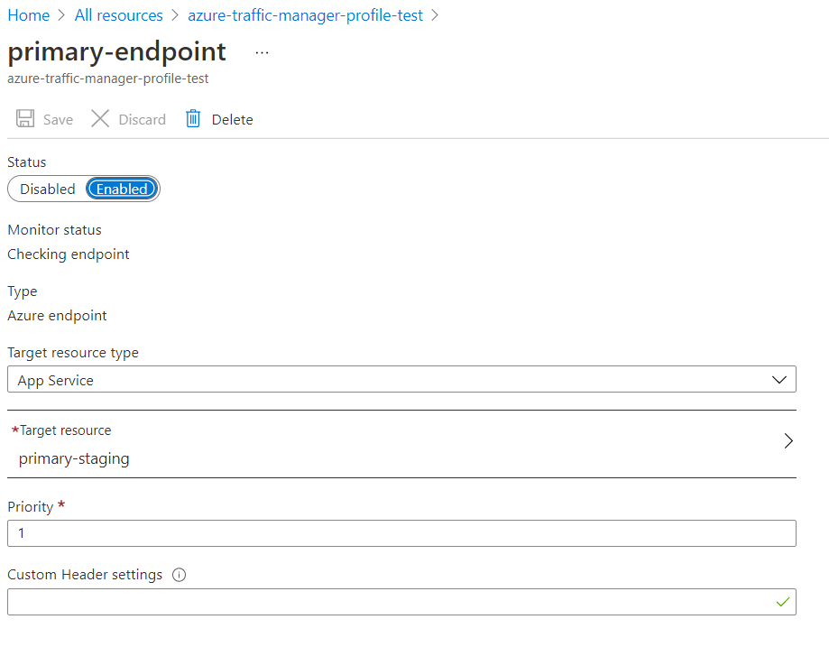
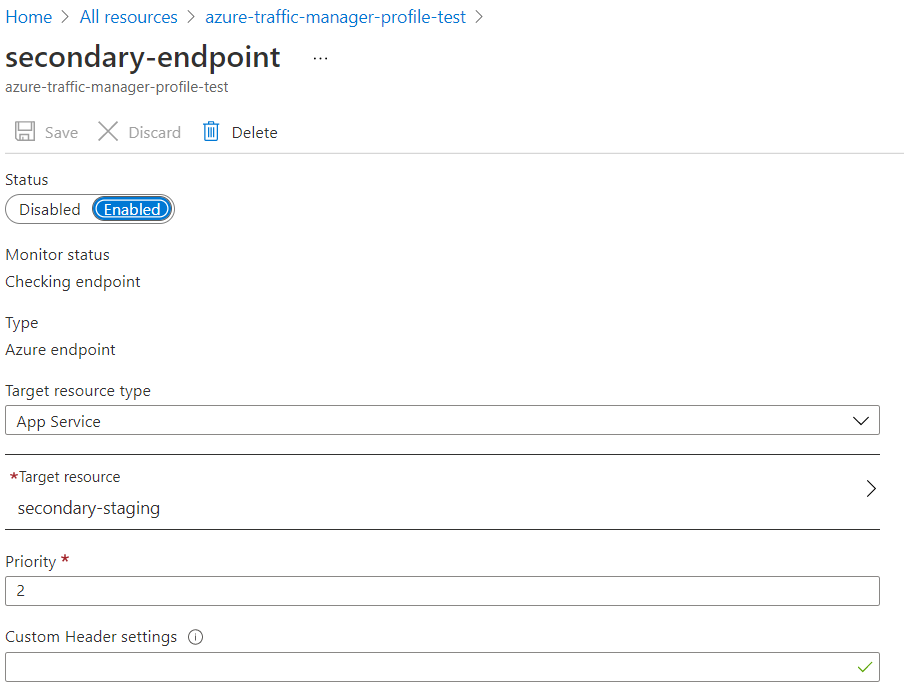
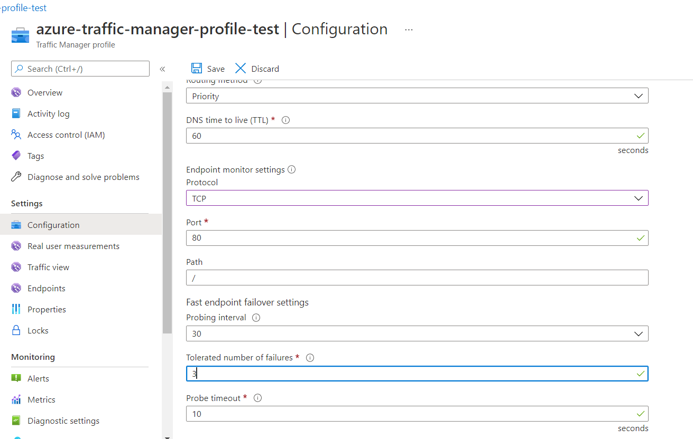
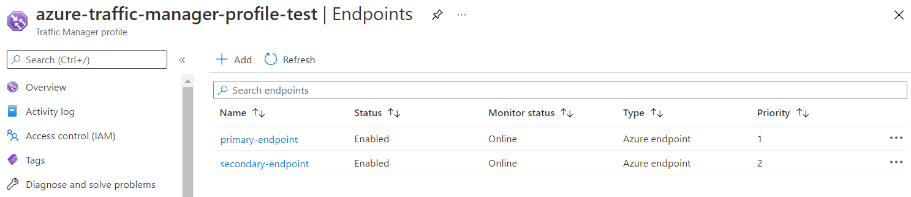

# Azure Traffic Manager Service

This is a DNS based routing service. While Azure Load balancer routes traffic based on network using tcp protocol and ip addresses.
Ex: Microsoft.com is a DNS name. It is linked to an IP which is linked to a resource where our request is routed tp Microsoft.com

**_Hence, Azure traffic manager can be used to route requests between multiple dns end points_**

To work with Azure traffic manager, first create a traffic manager profile. You can have multiple DNS endpoint which connect on to the traffic manager profile.

**Very important Note:** Azure Load balancer can only route traffic within a particular region, but Azure traffic manager is not bound by region. **IT IS A GLOBAL RESOURCE**

You can also have multiple routing methods that are available to you.

1. Priority \[route traffic to higher priority region/dns end points first.\]
2. Weightage \[ distribute traffic between region/dns end points by weightage \]

Note: there are several other methods available. Check [this](https://docs.microsoft.com/en-us/azure/traffic-manager/traffic-manager-overview).

## How to work with Azure Traffic Manager

1. We create 2 azure web apps
2. We deploy these webapps in different regions and
3. Then we define a traffice manager profile with these two end point
4. Once we bring bring down the primary web app, we should see that the traffic is being sent to the secondary web app
5. Please make sure to deploy same apps with different index.html to ensure we can identify from which region the site is being served. Publish the web app to both the regions

**Note:** make sure that the azure app service plan attached to the web apps is either standard or higher to use traffice manager

After publishing to both the regions the deployed sites look as below:

**Now**, lets create the traffic manager profile from Azure marketplace
Please check the below routing methods available for azure traffic manager:

**Note:** Notice that while creating this azure traffic manager profile, we don't have to specify any specific region or location

## How to work with traffic manager

- Please wait for the traffic manager profile to be created.
- Once the traffic manager is ready, define endpoints, in our case both primary and secondary endpoints for our primary and secondary dns names/website that we deployed.

  - If the endpoint is your on prem dns name, choose the `external endpoint`
  - in our case we have the Azure Web apps, so we will choose the `Azure endpoint`
  - 

- Coming to the target resource type:

  - Since we have web app service, we will select `app service`
  - If we had a VM, we will select the public IP Address, but rememeber since traffic manager is a dns based routing service, the VM should have the dns name assigned to it.
  - 

- Finally select the priority as 1 for primary website and 2, 3, 4...for subsequent website/end points

  - 

- It will finally look something like this
  - 
- Do the same for your secondary website and give the priority as 2. It should finally look like below:

  - 

- **Finally**, we must ensure that our endpoints are healthy. this can be checked using configuration tab of the traffic manager

  - 

- Wait for some time till you see the traffic manager endpoint is showing online.
  - 
