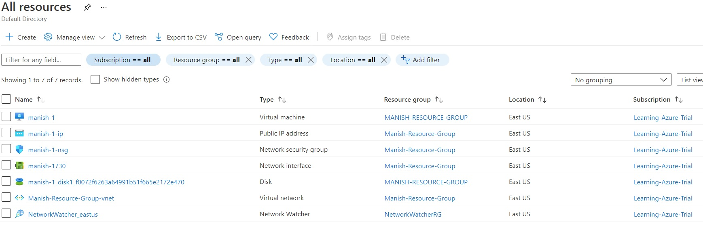

# Azure Virtual Machine Service

Before public cloud, a business had to have a physical server on premises and they that physical server used to have Virtual Machines hosted in those physical server using Hyper-V or VM-Ware tools. The business was responsible for the underlying maintenance and storage of the physical server.

In public cloud like Azure, the business doesn't have to worry about the physical server, they just need to take care of the virtual machines (VM). The underlying physical structure is completely managed by the Cloud Vendor.

### The Virtual Machine Service is known as Infrastructure as a Service (IaaS)

## Benefits of Azure Virtual Machine Service

- No need to worry about managing the underlying hardware
- No need to buy the physical server hence, less upfront investment
- Pay only for the running cost of the virtual server
- Terminate the virtual server at any time.
- You can host different type of workloads
- You can deploy both windows and Linus based servers

## Deploying a VM

Note: When we deploy a VM, there are a few things which get deployed with it.

- The virtual Network, i.e. the VM needs to reside inside a virtual network
- The VM itself
- The disks for Holding OS Data as well as we can add a disk for holding the user Data
- The Network Interface card \[contains public and private IP addresses\]
- And Most importantly, Network Security group(NSG). It acts like a firewall

Note: To create any account you will need a subscriptiona and a resource group.

## Things to note while creating a Azure VM resource

- Size: we can select from a variety of size (read computing power) of VMs. the estimated computing cost on a per month basis will be shown while creating a VM
- You will be prompted to enter a username and password, remember it for future usage. Your's is username is `manish` and `UZy@996sJR//1`
- By default, if you create a VMs the incoming traffic will be blocked (you will need to add a rule to NSG to allow incoming traffic), but if you are creating a Windows OS virtual machine, you will see a rule will get setup for you by default to allow trafic on port 3389 via RDP.
- By default, you will receive an OS disk in your VM, and you may choose to add additional disk for your data
- By Default, you will see that a Virtual network is also created along with VM. You can even use your existing virtual networks. The new VM and VNet should be in the same region.

  > **Subnet** is a logical separation of the address space of a Virtual Network

  > **Public IP Address** allows this virtual machine to be reachable from the internet

- In Management section of configuring an VM, you will have an option to enable boot diagnostics. All information will be stored in Azure storage account
- You can also enable auto shut down to bring down your operational costs
- NOTE: You can also download the template of the VM to do some sort of automation

Finally are reviewing and creating the VM, you will also receive the estimated cost of the VM and once the VM is created successfully, you can go ahead to "All Resources" to see what resources got created for one VM. Please refer below:

Note: _*You can pig the public IP of the newly created VM yet, as only RDP is allowed on port 3389*_

So, go ahead and download the RDP file and launch it to connect to your first VM using the password you created.

Note: _*While connecting to Azure VM from you local you can use \[public IP of the VM\]\\username and password in case directly providing username and password is not working. *_
