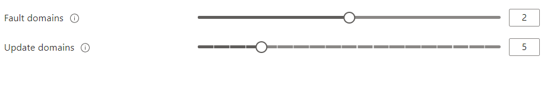

# Azure Virtual Machine Service

Before public cloud, a business had to have a physical server on premises and they that physical server used to have Virtual Machines hosted in those physical server using Hyper-V or VM-Ware tools. The business was responsible for the underlying maintenance and storage of the physical server.

In public cloud like Azure, the business doesn't have to worry about the physical server, they just need to take care of the virtual machines (VM). The underlying physical structure is completely managed by the Cloud Vendor.

### The Virtual Machine Service is known as Infrastructure as a Service (IaaS)

## Benefits of Azure Virtual Machine Service

- No need to worry about managing the underlying hardware
- No need to buy the physical server hence, less upfront investment
- Pay only for the running cost of the virtual server
- Terminate the virtual server at any time.
- You can host different type of workloads
- You can deploy both windows and Linus based servers

## Deploying a VM

Note: When we deploy a VM, there are a few things which get deployed with it.

- The virtual Network, i.e. the VM needs to reside inside a virtual network
- The VM itself
- The disks for Holding OS Data as well as we can add a disk for holding the user Data
- The Network Interface card \[contains public and private IP addresses\]
- And Most importantly, Network Security group(NSG). It acts like a firewall

Note: To create any account you will need a subscriptiona and a resource group.

## Things to note while creating a Azure VM resource (Windows/Linux)

- Size: we can select from a variety of size (read computing power) of VMs. the estimated computing cost on a per month basis will be shown while creating a VM
- You will be prompted to enter a username and password, remember it for future usage. Your's is username is `manish` and `UZy@996sJR//1`
- By default, if you create a VMs the incoming traffic will be blocked (you will need to add a rule to NSG to allow incoming traffic), but if you are creating a Windows OS virtual machine, you will see a rule will get setup for you by default to allow trafic on port 3389 via RDP. If it's Linux, it will open port 22 for Secure Shell (SSH).
- For connecting to Windows VM we can use Remote Desktop Connection on port 3389, and for connecting to Linux Vms we can use the Secure Shell (SSH) on port 22.
- By default, you will receive an OS disk in your VM, and you may choose to add additional disk for your data
- By Default, you will see that a Virtual network is also created along with VM. You can even use your existing virtual networks. The new VM and VNet should be in the same region.

  > **Subnet** is a logical separation of the address space of a Virtual Network

  > **Public IP Address** allows this virtual machine to be reachable from the internet

- In Management section of configuring an VM, you will have an option to enable boot diagnostics. All information will be stored in Azure storage account
- You can also enable auto shut down to bring down your operational costs
- NOTE: You can also download the template of the VM to do some sort of automation

Finally are reviewing and creating the VM, you will also receive the estimated cost of the VM and once the VM is created successfully, you can go ahead to "All Resources" to see what resources got created for one VM. Please refer below:

Note: _*You can pig the public IP of the newly created VM yet, as only RDP is allowed on port 3389*_

So, go ahead and download the RDP file and launch it to connect to your first VM using the password you created.

Note: _*While connecting to Azure VM from you local you can use \[public IP of the VM\]\\username and password in case directly providing username and password is not working. *_

## Make your newly created VM (Windows) into a Web server to host applications

- Connect to VM using an RDP connection
- Open Server Manager
- Click on "Add roles and features"
- Next - Role based or feature based installation
- Select your server from your server pool - Next
- Select the Web Server (IIS) feature - Add feature - Next
- Click on all the nexts the finally click on "Install"
- Now you can access the localhost from inside and outside the server

Note: _*To access localhost from outside the server(your VM ofcourse), you can use the public IP address of your VM. But we know that IIS uses to port 80, so in your NSG you must add the rule to allow incoming traffic at port 80*_

## Types of VMs

Each VM type belongs to a particular VM Family. Each Series gives us different features and capapbilities.

Examples:

- A-series for simple entry level economical VMs
- F-series for compute optimized, for workloads like batch processing or analytics or gaming
- G-Series for memory and storage optimized, for workloads like large SQL and NoSQL databases, ERP and SAP or Data warehousing

### More at Azure VM [Series](https://azure.microsoft.com/en-in/pricing/details/virtual-machines/)

## Pricing calculator for Azure can be found below

Pricing [Calculator](https://azure.microsoft.com/en-in/pricing/calculator/)

Remember, the compute and disk usage charges will be separate but included in the calculator. Even if you decommission the compute resources, you may incur a fraction of charges on disk resources.

## State of VMs

- We can shutdown a VM from the azure portal and the from inside the VM itself, only difference is, if you shut the VM down from the portal, there may be chances that upon shutdown the VM will move to a different physical host or gets deallocated from the underlying physical host/server (it may restart from same physical host or a different host - it's not in our control), thus we have see that the **public IP of the VM is changed once it is started again**. The IP will change when shutdown happens from the insdie the VM.
- If you have a web application that needs to have an IP that does not change consider using a `static IP`. For seeting the public IP as static, just go to the `Public IP address` resource and change it from `dynamic` to `static`. It may reboot your VM.
- If you want to store application data on a separate volume apart from the OS level disk, consider attaching data disks. in case of a shutdown of VM you will loose the data on the temporary drive, i.e. the D Drive of the VM. so please make sure to attach you own Disk drive(s).

## Linux VMs: steps to start a webserver in Linux VM

- Connect to Linux VM through SSH (open putty, give the Linux VM's public ip and connecting using SSH.)
- provide your username and password, which you setup while creation.
- Once SSH is connected properly, run `sudo apt-get update` in Command Line Interface.
- to install nginx, you can now use this command in SSH console to install nginx: `sudo apt-get install nginx`
- remember, we need to /add the incoming traffic on Port 80 for nignx to be accessed from the internet
- Finally spin up the Linux Vm and search the VM's Public IP in the browser to see the nginx startup page.

## Azure Marketplace

Azure [Marketplace](https://azure.microsoft.com/en-in/marketplace/) is a place where you can find all sorts of products compatible with Azure. You can spin up custome VM from images available in the marketpalce, for example you can have a VM for Wordpress or you may also have a Windows 10 client machine.

Note: **Some of the custome images may have additional costs associated with them.** That means, you may be charged for the software solution plus the VM service.

## Azure Availability Sets

No infrastructure in 100% available at all times, so we should have room for mishaps. Azure provide Availability Sets to handle this problem.

**If you have two or more instances deployed in the same Availability Set, you will get a SLA of 99.95% for Virtual Machine COnnecitivity to at least one instance. It is the user responsibility to assign the VMs in an Availibility Set.**

Availibility Sets will ensure that the instances of VMs are assigned properly in:

- Fault Domain
  > Any power outage or unforseen event leading to shutdown of the underlying physical infrastructure can be handled by handled if VMs are distributed accross multiple fault domains. Azure's Availibilty Sets handled this fine.
- Update Domain
  > Any necessary patches or updates that require the underlying physical infrastructure to be restarted or upgraded, will not impact the associated VMs, if the VM instances are distributed accross multiple Update Domains. Again Azure handles it fine.

Azure has the below Fault Domains and Update Domains:

Azure also offers Proximity palcement group to allows us to keep our VMs closer together in the same availibilty set.

