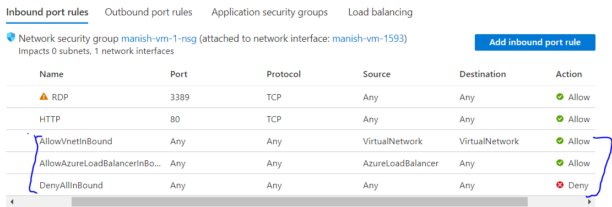

# Azure Virtual Network

IP address helps to identify any resource in the internet.
When we spin up a VM in Azure, it needs to be part of a Virtual Network (VNet)

Azure Virtual Network consists of IP address range. It can be default what's supplied by Azure or even you can supply it yourself.

In a VNet,You can spinup subnet, which is a logical separation of resources within the VNet. Each subnet have an address range which will be the subset of the address range of the VNet. You can spinup VMs in these subnets.
Example:

- IP address: 10.0.0.0/16, address space \[ 10.0.0.0 - 10.0.255.255 (65536 addresses)\]
- Subnet1: (default subnet)10.0.0.0/24, address space \[ 10.0.0.0 - 10.0.0.255 (251 +5 azure reserved addresses)\]
- Subnet2: 10.0.1.0/24, address space \[ 10.0.1.0 - 10.0.1.255 (251 +5 azure reserved addresses) \]

**Private IP address** is the IP address from the address range of the subnets which the VMs or resources can used within the VNet to communicate with each other. This is not accessible outside the VNet.

**Public IP address** is the IP address which is assigned to a resource within a VNet, and this IP address is accessible from the open internet.

**Note:** _*It should be noted that we should design our Application in such a way that only those resources are exposed to internet via a subnet which are actually needed to be exposed. If we have two VMs one for web server another for database, then it makes sense to have the Database VM inside a subnet which is different than the subnet where web server VM is located. And we can ensure that the database VM doesn't have a public IP. the Webserver VM can communicate with DB VM via the private IP address within the VNet.*_

**Note:** _*Ensure that the VMs and other resources are created within the same azure region as the VNet to be able to access the VNet.*_

**Note:** _*By default, communication between two virtual networks is not possible as VNet by default work in isolation. to connect these two networks we have a couple of options like virtual network peering.*_

## Network Security Groups (NSG)

The NSGs are used to control the flow of traffic into (inbound) and out (outbound) of the virtual machine.
Its a separate resource in Azure and it gets attached to the network interface card that's attached to your VM.

NSG can be linked to network interface card of your resource/VM or it can be linked to your entire subnet. If its linked to your subnet, then it affects all the VMs in the subnet.

### Defining a rule in NSG requries the below

1. Priority \[ lower the priority number assigned, the rule will be applied first \]
2. Port (http:80, https:443, RDP:3389, SSH:22)
3. Protocol: TCP/UDP
4. Source and Destination IP addresses( of VM or Vnet)

**Note:** _*Please note the below three rules which are noted in the below snippet*_

## Application Security Groups

You can assign Application Security groups in the Azure to handle the resquest coming to specific ports and based on the type of role the VM is playing.
If we have a bunch of VMs for Webserver, create an ASG for webserver, and for database server, create another ASG. Now in application security groups assign those VMs respectively. Finally in network security group, assign these ASGs with relevant port number on which traffic needs to be handled.

## Network connectivity options

### Virtual Network peering

In Azure, the VNets are isolated.
You can create Virtual network Peering to connect two isoloated VNets and enable communication in between the resources.

### Point-to-Site VPN Connection

This type of connections happens over the internet. When you have a set of client work stations that need to connect to an Azure VNet over the internet. Instead of using public IP address to access the VNet resources/VMs the client workstations use the private IP addresses fo the VNet resources. This requires a Virtual Private Network (VPN) connection between your VNet and the client workstations.
To achieve this, we need to implement VPN gateway resource, and in this resource we need to configure Point-to-Site (P2S) VPN Connection. This scenario makes use of certificates for authentication.

### Site-to-Site VPN Connection
