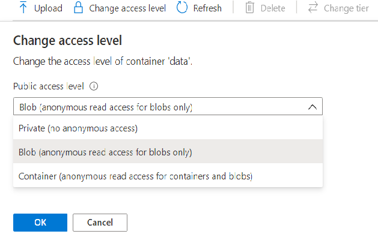
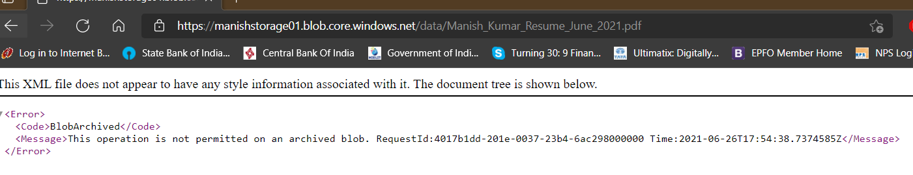
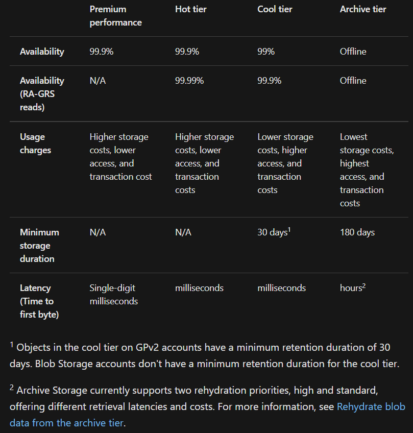
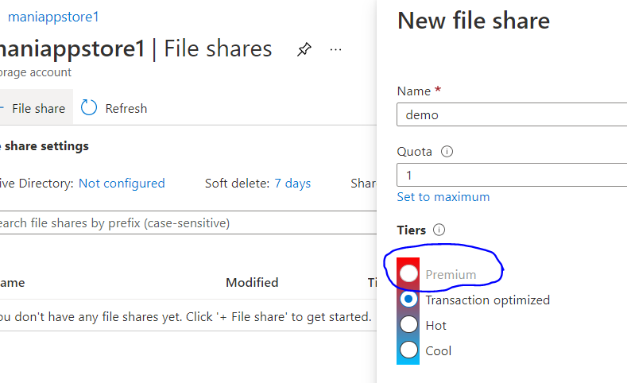
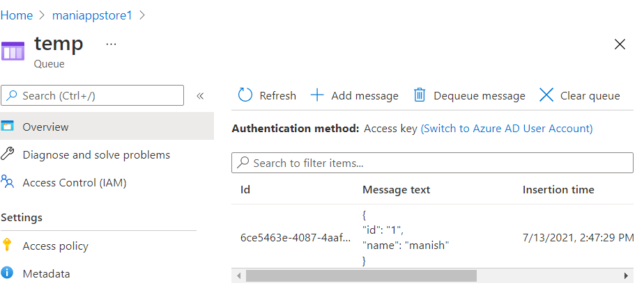

# Introduction to Azure Storage

## Storage Accounts

1. **Blob Service:** It is used for object level storage in an Azure storage account. In an application, we can store data into the VM itself, but that is a potential point of failure. If the VM goes down, the data will be lost Blob service is highly scalable, highly available and highly reliable option and we can use it to store any amount or type of data. It is independent of VM. It can also be used to storge your disks for your VMs.

2. **Table Service:** Azure storage can store just a table without any foregin keys or any other kind of relation. These are highly scalable and idel for handling large amounts of data. It has three parts: Tables, Entities, and Properties
   Example: list of Books(Table), Book(Entity), price(Property)

3. **File Service:** These are highly available file shares in your Azure storage. you can use these file shares in multiple VMs and users. We connect to the file share using Server Message Block(SMB) protocol.

4. **Queue Service:** It is used for receiving and sending messages. similar to MQ or JMS.

## Things to note

- Azure Storage name should be unique
- Standnard perfomance option give: Blob service(Blob Container), Table Service, Queue Service and file shares. In Premium option, you get to work with Block Blobs, File share and Page Blobs
- By default soft delete will be enabled to ensure the deleted objects/blobs are kept in backup for last 7 days.
- Redundancy: to ensure high availability, various redundany options are provided by Azure
  

## Blob Service \[ Binary Large Object \]

To upload any object in Blob service, first created a container. You can simply create a container in azure storage account and use to hold any object, a file or a image but in the end, the data is stored in binary format.

Container is a logical unit that is used for hosting your object.

You edit, download and the file you stored in Blob, and you also get an URL for each specific object to access or download it. Example below
[Our uploaded file](https://manishstorage01.blob.core.windows.net/data/Manish_Kumar_Resume_June_2021.pdf)

**Note:** The file may not be accessible if the storage account is deleted or if the file has been accessed annonymously. To fix later, you can change the access level in as shown below in Blob service.


We can allow applications to access the data stored in the storage account.

### Access Tier

At storage account level: Hot and Cool
At Blob object level: Hot, Cool and Archive. Hot is default. Hot is also the prociest to store. while Cool and Archived have much higher read/access rate.

Note: Archive access tier will not be available and its access will take time. We will need to rehydrate the blob, i.e. Change Tier to Hot or Cold, give rehydrate priority as Standard or higher, then it will take time to change its tier and make the file available for download.



More details are [here](https://docs.microsoft.com/en-us/azure/storage/blobs/storage-blob-storage-tiers)



## Data Replication & Data Redundant Storage


### Some definitions

1. Geography: A discrete market,typically containing 2+ regions, that preserves data residency and compliance boundaries
2. Azure region: a set of datacenters deployed within a latency-defined perimeter and connected through a dedicated regional low latency network
3. Region pair: each Azure region is paired with another region within the same geography
4. Availability Zones: a physically separate location within an Azure region. Each AZ is made up of 1+ datacenters with independent power, cooling and networking.
5. Availability: defnied by gartner as the assurance that an enterprize's IT infrastructure has suitable recoverability and protection from the system failures, natural disasters or malicious attacks. High Availability refers to a system that is operational without interruption for long periods of time by using redundant or fault tolerant components and is typically measured as a percentage.
6. Recovery point objective(RPO): the amount of data which can be lost while bringing the system back online after a critical failure, i.e. the point in time to which the data be recovered.
7. Recovery time objective(RTO): the amount of time that it takes to get the system back online after a critical failure, i.e. how long you can sustain a service interruption before you absolutely need to be back online.

| Locally Redundant Storage (LRS) | Geo Redundant Storage (GRS) | Zone Redundant Storage (ZRS) | Geo-zone-redundant storage (GZRS) |
| ------------------------------- | --------------------------- | ---------------------------- | --------------------------------- |

More details on Azure Data redundancy is [here](https://techcommunity.microsoft.com/t5/azure-storage/understanding-azure-storage-redundancy-offerings/ba-p/1431700)

**Note:** Be aware of potential data loss! Always check LastSyncTime before executing the failover.

## Azure File Share Service

Multiple users can use a file share to store their data. It uses **Server Message Block** protocol

New file share will be create similar to how we create a blob storage, but we must have a premium storage account to have a premium file share.



Remember that the concept of different rate / cost of access or read and write operation will also applied here.
Hot tier will be procey to store data but cheaper while reading, which just opposite to Cool tier. so understand your data needs first.

Within a file share you can create a directory and upload upload any file.

**Note:** You can connect to the azure fileshare to you local machine too.

Go to the storage account -> file share -> then click on connect.
Once clicked, it will open the command that you can run in you corresponding operting system.
Give an appropriate drive letter and select authentication as Storage account Key.
In our case it was Windows, I open windows powershell and paste the command, the command wirst check the port 445 is open or not. Once testing is successful, It will add the new fileshare with the selected letter to your ocal machine.
You can even create new files in it, and see it reflected in your fileshare in real time. Check below

```powershell

Windows PowerShell
Copyright (C) Microsoft Corporation. All rights reserved.
                                                                                                                        Try the new cross-platform PowerShell https://aka.ms/pscore6                                                                                                                                                                                    PS C:\WINDOWS\system32> $connectTestResult = Test-NetConnection -ComputerName maniappstore1.file.core.windows.net -Port 445                                                                                                                     PS C:\WINDOWS\system32> if ($connectTestResult.TcpTestSucceeded) {
>>     # Save the password so the drive will persist on reboot
>>     cmd.exe /C "cmdkey /add:`"maniappstore1.file.core.windows.net`" /user:`"localhost\maniappstore1`" /pass:`"3D/1+WBEZgEJGyGI0euVBCxpfGPwES9FdvMFcC4aBWvNWnwDHooUeBPRxgcx9klkITBYoyxX2zrg7Pdb5Lt3VQ==`""
>>     # Mount the drive
>>     New-PSDrive -Name Z -PSProvider FileSystem -Root "\\maniappstore1.file.core.windows.net\demo" -Persist
>> } else {
>>     Write-Error -Message "Unable to reach the Azure storage account via port 445. Check to make sure your organization or ISP is not blocking port 445, or use Azure P2S VPN, Azure S2S VPN, or Express Route to tunnel SMB traffic over a different port."
>> }

CMDKEY: Credential added successfully.

Name           Used (GB)     Free (GB) Provider      Root                                               CurrentLocation
----           ---------     --------- --------      ----                                               ---------------
Z                   0.00          1.00 FileSystem    \\maniappstore1.file.core.window...


PS C:\WINDOWS\system32>
PS C:\WINDOWS\system32> z:
PS Z:\> dir


    Directory: Z:\


Mode                 LastWriteTime         Length Name
----                 -------------         ------ ----
d-----        13-07-2021     14:20                data


PS Z:\> cd data
PS Z:\data> dir


    Directory: Z:\data


Mode                 LastWriteTime         Length Name
----                 -------------         ------ ----
-a----        13-07-2021     14:20          61589 pic.jpeg


PS Z:\data>
PS Z:\data> echo "this is new file" >newfile.txt
PS Z:\data> dir


    Directory: Z:\data


Mode                 LastWriteTime         Length Name
----                 -------------         ------ ----
-a----        13-07-2021     14:27             38 newfile.txt
-a----        13-07-2021     14:20          61589 pic.jpeg


PS Z:\data>


```

## Azure Queue Service

This service works the same way as any other service queue like JMS or MQ queue. They can be create the same way from the storage account.
Go to storage account-> select queue service

you can add messages to and also you can dequeue messages from it programmatically.


