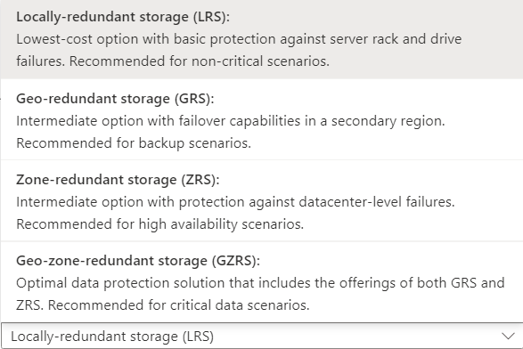

# Introduction to Azure Storage

## Storage Accounts

1. **Blob Service:** It is used for object level storage in an Azure storage account. In an application, we can store data into the VM itself, but that is a potential point of failure. If the VM goes down, the data will be lost Blob service is highly scalable, highly available and highly reliable option and we can use it to store any amount or type of data. It is independent of VM. It can also be used to storge your disks for your VMs.

2. **Table Service:** Azure storage can store just a table without any foregin keys or any other kind of relation. These are highly scalable and idel for handling large amounts of data. It has three parts: Tables, Entities, and Properties
   Example: list of Books(Table), Book(Entity), price(Property)

3. **File Service:** These are highly available file shares in your Azure storage. you can use these file shares in multiple VMs and users. We connect to the file share using Server Message Block(SMB) protocol.

4. **Queue Service:** It is used for receiving and sending messages. similar to MQ or JMS.

## Things to note

- Azure Storage name should be unique
- Standnard perfomance option give: Blob service(Blob Container), Table Service, Queue Service and file shares. In Premium option, you get to work with Block Blobs, File share and Page Blobs
- By default soft delete will be enabled to ensure the deleted objects/blobs are kept in backup for last 7 days.
- Redundancy: to ensure high availability, various redundany options are provided by Azure
  

## Blob Service \[ Binary Large Object \]

To upload any object in Blocb service, first created a container. You can simply create a container in azure storage account and use to hold any object, a file or a image but in the end, the data is stored in binary format.

Container is a logical unit that is used for hosting your object.

You edit, download and the file you stored in Blob, and you also get an URL for each specific object to access or download it. Example below
[Our Uploaded file](https://manishstorage01.blob.core.windows.net/data/Manish_Kumar_Resume_June_2021.pdf)
