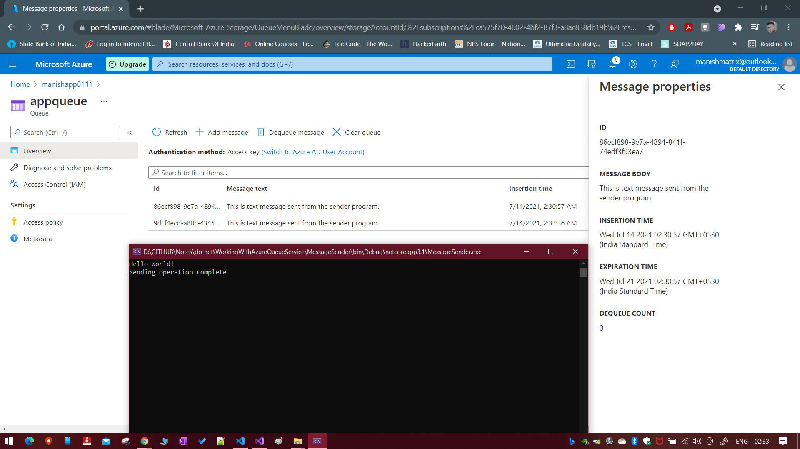

# How to use the azure storage in .net core

## Using Blob Service

1. Create a .net core console application.
2. Then import/install the nuget package `Azure.Storage.blobs` for interacting with Azure storage account service blob.
3. Choose your project and install, please refer below
   

4. Create a Blob in your azure account, say `data`
5. Go the corresponding storage account and get the `Access Keys` from the portal
6. Click on Show Keys and copy the anyone of the connection strings to use it in your .net core console app

7. Follow the programming as shown in `GITHUB\Notes\dotnet\AzureBlobOnDotNetCore\`
8. Refer the image of output below:
   

## Using Queue Service

1. Create a .net core console application.
2. Then import/install the nuget package `Azure.Storage.queues` for interacting with Azure storage account service queue.
3. Choose your project and install, please refer below
   

4. Since we are now working with Azure queue service, we will need a sender and a receiver. Please refer the code at `GITHUB\Notes\dotnet\WorkingWithAzureQueueService\`

5. Go the corresponding storage account and get the `Access Keys` from the portal

6. Follow the program for sending the messages to queue from the below `GITHUB\Notes\dotnet\WorkingWithAzureQueueService\MessageSender`
   

7. Follow the program for receiving the messages from queue from the below `GITHUB\Notes\dotnet\WorkingWithAzureQueueService\MessageReceiver`
   
