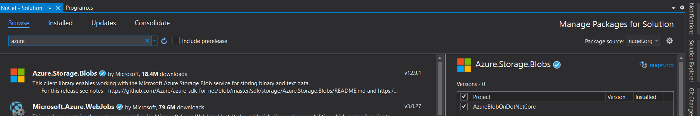
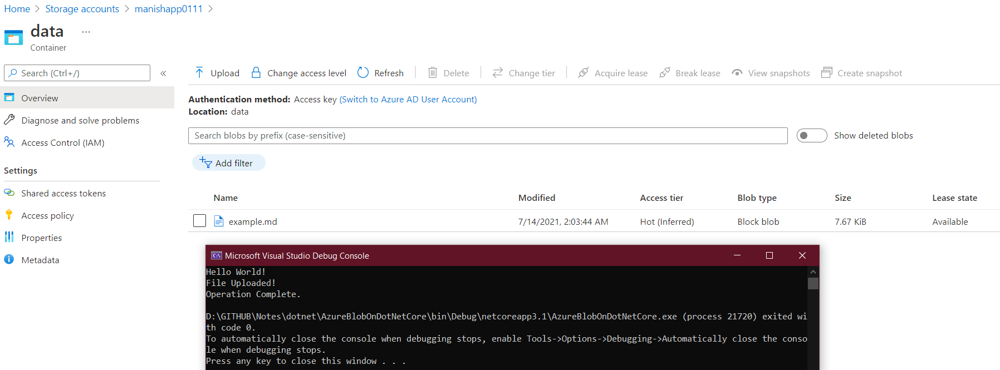

# How to use the azure storage in .net core

1. Create a .net core console application.
2. Then import/install the nuget package `Azure.Storage.blobs` for interacting with Azure storage account service.
3. Choose your project and install, please refer below
   

4. Create a Blob in your azure account, say `data`
5. Go the corresponding storage account and get the `Access Keys` from the portal
6. Click on Show Keys and copy the anyone of the connection strings to use it in your .net core console app

7. Follow the programming as shown in `GITHUB\Notes\dotnet\AzureBlobOnDotNetCore\`
8. Refer the image of output below:
   
