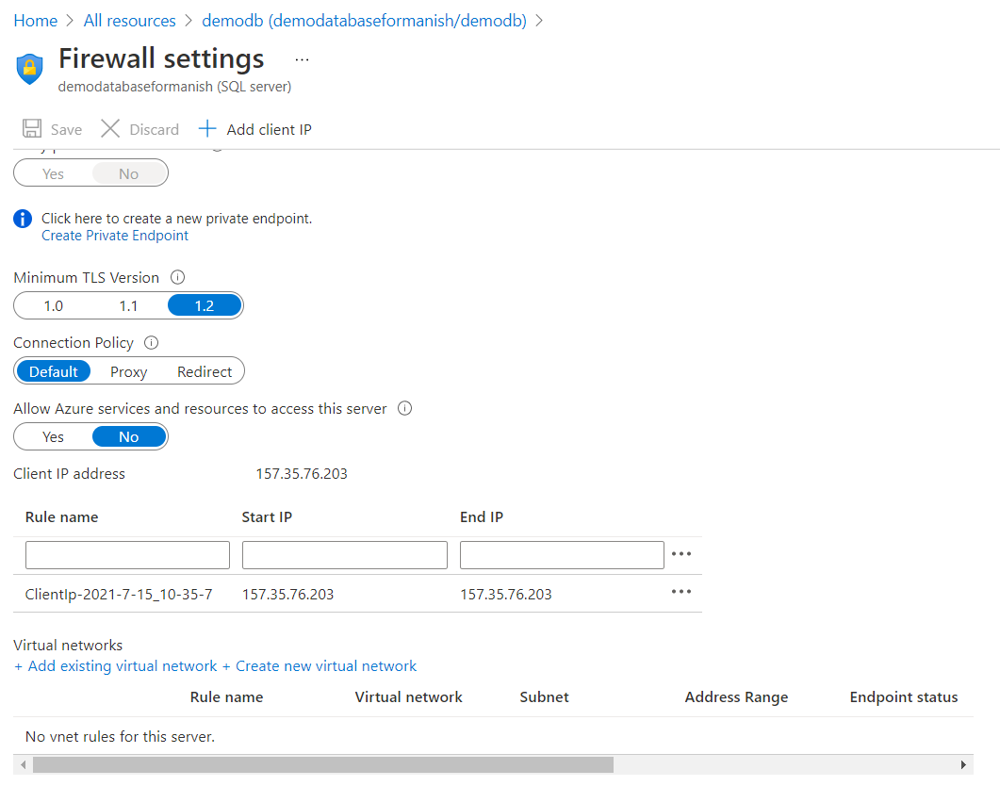

# Azure SQL Server Database service

## How options do we have

1. Infrastructure as a Service

   > Here we will first create a VM on Azure, then we go ahead and install SQL server software. Once that is done, we install the sql management studio to create and manage databases.

   > Advantage is the we have full control over the SQL Engine. Its very easy to migrate from an on-premise instanc, becasue you can install your own database version. it also provide Provate IP addressing

   > Disadvantages are: you are responsible for managing underlying VM and SQL Instance. You also may have to implement your own high availabiltity solution and you also need to manage the backups

2. Platform as a Service

   > Azure SQL Database option provides a lot of benefits. You don't have to worry about managing the underlying VM. The platform manages it for you. it takes care of backup or patching etc.. You can just go ahead and setup the database itself

   > Advantages are: 99.99% availability, automated backups, recovery and patching and it also has built in advanced intelligence and security

   > Disadvantages are: Migration from an existing on-premise server instance will be very difficult, some SQL features may not be available,and you will not have the concept of provate IP addressing instead you will have to manage access through firewalls.

## Types of Azure SQL databases

1. Single Database -> you can create a single database on Azure sQL server
2. Managed Instance -> Preferred option for companies who just want to lift and shift their exisitng databases to Azure
3. Elastic pool -> We can also combine multiple sql databases so that all of them share the underlying resources and save cost.

## Azure SQL Server: Purchasing MODELS

1. Database transaction Unit (DTU model)

   > Blendedmeasure of CPU memory and read and write rates

   > There different service tier available. Refer [this](https://docs.microsoft.com/en-us/azure/azure-sql/database/service-tiers-dtu)...

2. vCore-based model

   > Here you can independently scale your compute and storage.

   > you can also choose different service tiers. Refer [this](https://docs.microsoft.com/en-us/azure/azure-sql/database/service-tiers-sql-database-vcore)

   > You also have replicas for ensuring high availability

   > You can also make use of the Azure Hybrid Benefit, i.e. you can save cost if you have exisitng sql server license

3. Managed Instance Offer

   > Newdeployment model which allows for easy migrationof existing on-premiseSQL server databases

   > Provides 100% compatibility with the latest SQL server on-proemise (Enterprise Edition) database Engine

   > Native virtual netowrk implementation more secure than firewalls

   > No management if the infrastructure

## Working with a SQL database

Note: the underlying SQL server that you create will be managed by Microsoft

We can create it similar to any other resource. New resource->SQL databases->Create-> give proper details like database name and sql database server name (must be unique) `demodatabaseformanish.database.windows.net`-> give username `manish` and password `UZy@996sJR//1` (this will be used in sql management studio to access the DB)

Note: You should choose your compute and storage ccording to you needs by clicking on `Configure Database`.
Different configurations are listed below:

Note: by default no one will be able to access the database you created just now.
you may need to add new firewall rules to permit its access to users. You can also go ahead and add your current IP to allowed list by simply selecting the "Add current client IP address"

once the sql server and database is create, you can actually set some more firewall rules to enable other clients to connect to the database. as below by using "Set firewall":

select the new sql database -> click on `Set server firewall`-> then you can specify the ip address or IP address range to be included / approve to connect to the database

Note: Add some sample data or backup data as below:

**This will create a sql database and a sql server (managed by microsft offcourse)**

## Using the Azure SQL server database from your local

- Download the Sql Server Management studio
- Connect using the server name and sql server authentication (i.e. the username and password created during the creation phase of the sql server database)
- if you have choose to select the demo database provided by microsft you will see some table in the database automatically

Note: You can even you sql query editor on Azure portal associated to your Azure SQL Database!!!

