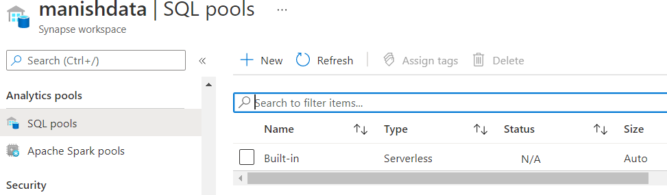
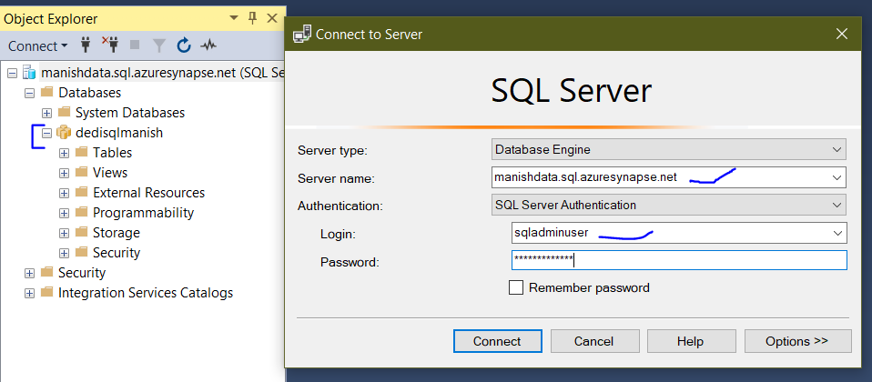
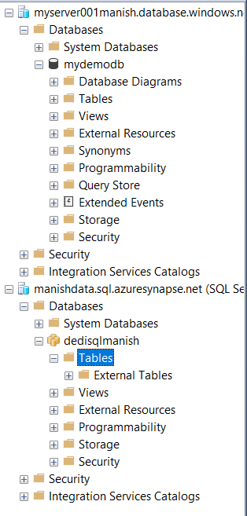
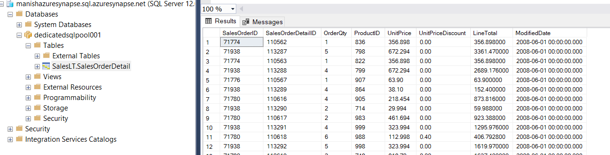

# Why SQL Data Warehouse

Data is all around us and companies like to collect data or use their existing data to improve upon their existing services and products. They can even use data to focus more of obtaining new customers and new assets. A well articulated way of storing analysizing data is needed to come to a result this complicated.

Example, for a Web application: the company may want to know which geography or demographic is using this web app and help design content and advertize more relevant product on their website.

A Typical Data Lake may look like:
WEB APP/MOBILE APP/SERVER LOGS -> DATA INGESTION LAYER -> PREPARAE AND TRAIN YOUR DATA -> DATA WAREHOUSE -> PERFORM ANALYTICS (using PowerBI)

Note: when working with SQL Data Warehouse, avoid inserting data one by one, but load data as a set.

## Azure Synapse Workspace

To work with Data Warehouse, Azure provides **Azure Synapse Analytics**. The Azure synapse workspace with contains various assets which includes our SQL Data Warehouse.

Creating an Azure Synapse Workspace is same as any other resource, but we will need `Data Lake Storage Gen2` storage account. Give the values as prompted, and for credentials:

Username:`sqladminuser`
password:`UZy@996sJR//1`

In Azure Synapse workspace, you get by default `SQL Pools`(which is the most important part of it), here you can go ahead and use this "Built-in" Serverless SQL Pool to access data in Azure Storage account or Data Lake Storage Gen2 account.
You can also create a `Dedicated SQL Pool` if you want the tables to persists.

**NOTE**: Creating a Dedicate SQL Pool is very costly, so make sure to delete the resource once your work is done, well, at least in trial version.

When you create a Dedicate SQL Pool, you will able to connect to it using SQL Management Studio, just like you would with a Database.
Just use username from overview page and the password you created earlier to connect to the workspace.
As shown below:

Note: Primary purpose of Azure synapse is to host your SQL pools

## Transferring data from an Azure SQL database to Azure dedicate SQL Pool

To do this, I

- created a new Azure sql database, with sample data.
- I already had the dedicate sql pool from above.
- created a resource called "azure data factory".

  > Azure Data factory Service is an ETL (Extract dat from source, transforming your data and Loading the data in a destination) tool.

- connect the sql datbase using ssms tool.

- Now we create the Azure data fatory service resource.
- Once created we need to oen the service console and create connections with source and destination of data and then deploy it.
- Once deployment is done, a pipeline will be created and data will be copied from sql database to dedicate sql pool in synapse workspace

Please refer below:

1. Before data copy using data factory

   

2. After data copy

   
