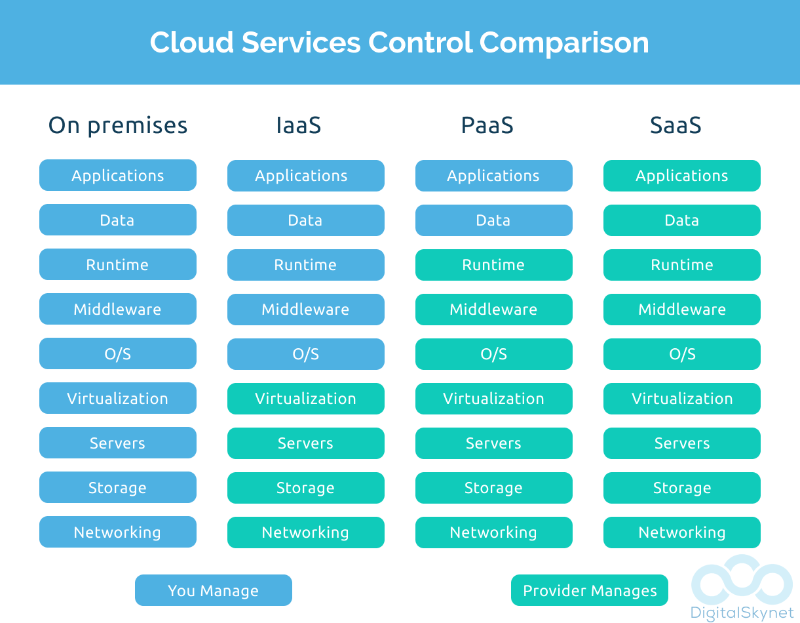

# Cloud service Model

There are three type of cloud service model:

- Infrastructure as a Service (IaaS)
- Platform as a Service (PaaS)
- Software as a Service (SaaS)

**Note**:

- Scale up: increase virtual cpus
- Scale down: decrease virtual cpus
- Scale out: increase the number of virtual machines
- Scale in: decrease the number of virtual machines

**Note**:

- Elasticity: architecture which can scale on demand
- Disaster Recovery: This refers to the concept of minimizing IT disruptions by recovering them to another data center that could be located hundreds to miles away from the original data center hosting your application.

## Infrastructure as a Service (IaaS)

- An example is the Azure virtual machine service
- Here you don't need to manage the underlying infrastructure.
- The physical servers and storage is managed for you
- This helps remove the capital expense and reduces ongoing cost
- The virtual machine also has a very high SLA. To achieve that SLA for any on-premise server would require a lot of work.
- Infrastructure cloud services also allow you to scale on demand using Azure Virtual Machine Scaleset, that accomplishes that.

## Platform as a Service (PaaS)

- An example is the Azure SQL Database or the Azure Web App service
- Here you don't have to manage the infrastructure or even the underlying operating system and platform components
- You can just start hosting your data or your web application
- Reduces development and deployment time.
- You can also use an array of database technologies available in the case of Azure
- All of these services are Pay-as-you-go model

## Software as a Service (SaaS)

- An example is Microsoft Office 365
- Here you don't need to manage the infrastructure or even the underlying operating system, platform components or even the software
- Here you just start directly using the software
- You can access your application data from anywhere.
- You don't have the headache of managing anyhting.

## Cloud Model Types

### Public cloud

- These are services that are offered over the public internet.
- Its available to anybody who wants to use them. Users then pay based on service they use.
- Here all the servers and storage is managed by the cloud provider.
- Ex: Azure, AWS and GCP
- No need for a capital investment - you normally don't pay an money upfront to use a cloud service. Most of the services are based on a pay-as-you-go model.
- you don't need to manage the underlying physical infrastructure. Hence on-going maintenance costs are also reduced.
- Cloud providers such as Azure have data centers located at different regions accross the world
- You can quickly provision resources on the cloud. It allows you to get up and reunning in no time.

### Private Cloud

- These are set of services that are normally only used by users of a business or organization.
- The private cloud could be hosted either on the companies's on-premise environment. Or, it could be provided by a third party service provider.
- The business has complete control over the environment.
- They can implement their own security protocols at every layer to secure the environment.
- The data held in the environment is in complete control by the business.

### Hybrid Cloud

- This is a combination of both the public and the private cloud
- It allows data and applications to be shared accross both the cloud environments.
- Businesses can still leverage their existing on-premise environment. This is important if they have already made a substantial investment in getting their environment in place.
- They can keep data which needs to be secured by their standards in their on-premise environment.
- They can extend their infrastructure to the cloud making a further investment.
- They can move workloads to the cloud gradually.

## Economies of scale

- This is the ability of carrying out tasks more efficiently or at a lower cost per unit when operating at a larger scale
- Cloud providers can actually buy hardware at a large discount.
- And they can pass the costs to customers.
- And if the number of customers increase, the chances of services costs can go down

### Capital Expenditure

- This is the spending of money on physical infrastructure upfront.
- Examples of Capital expenditure
  > Server costs, Storage costs, network costs, backup adn archive costs, datacenter infrastructure costs, buy software licenses

### Operational expenditure (OpEx)

- Ongoing money spent for services and products
- This is a recurring cost
- Yearly support agreement with vendors that need to be renewed
- Keeping hardware running - thie electricity, cooling etc.

## Shared responsibility model

Please refer the below screenshot:

