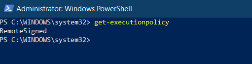

# Using Tools other than the Azure portal

- Powershell
- Azure Command line interface (Azure CLI)
- Azure Cloudshell (Powershell/bash inside Azure portal)

## Using Powershell (Execution Engine)

- Open powershell as Administrator
- Make sure that the execution policy in powerhell is set as `RemoteSigned`, if not run command `Set-ExecutionPolicy RemoteSigned`

  - 
  - This will allow us to install remotely signed packages

- The we run the command `Install-Module -Name Az -AllowClobber -Scope CurrentUser` to install all of the azure modules for the current user
- Run command `Import-Module Az -Verbose`
- Once modules are imported, run `Connect-AzAccount` to login into microsoft Azure
- Now we can run Azure commands: Run `Get-AzResourceGroup -Location centralus` to get resources from centralus region
