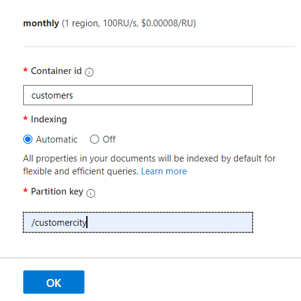
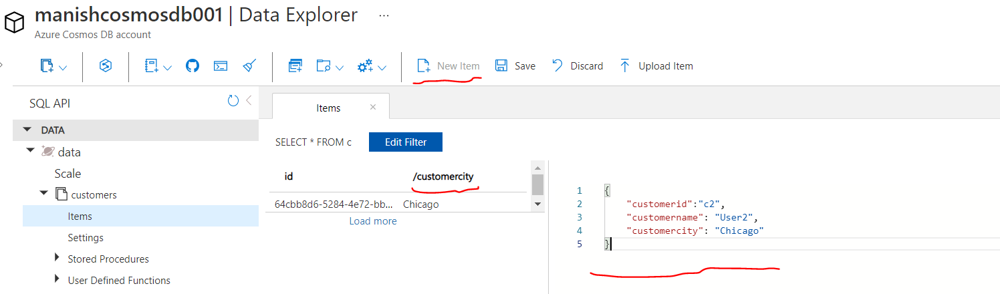
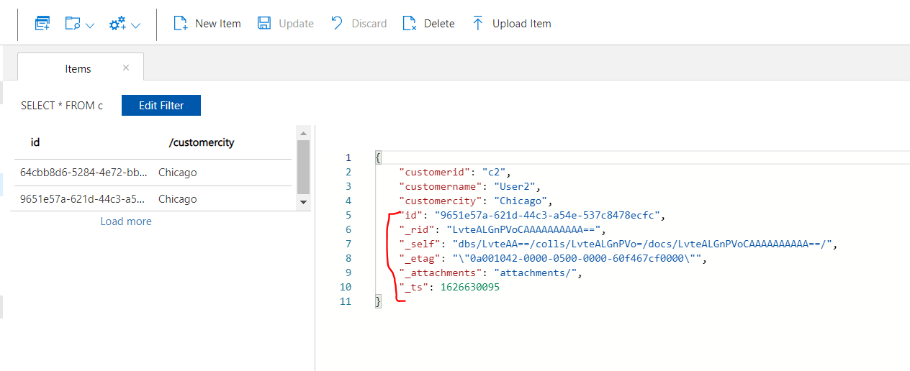
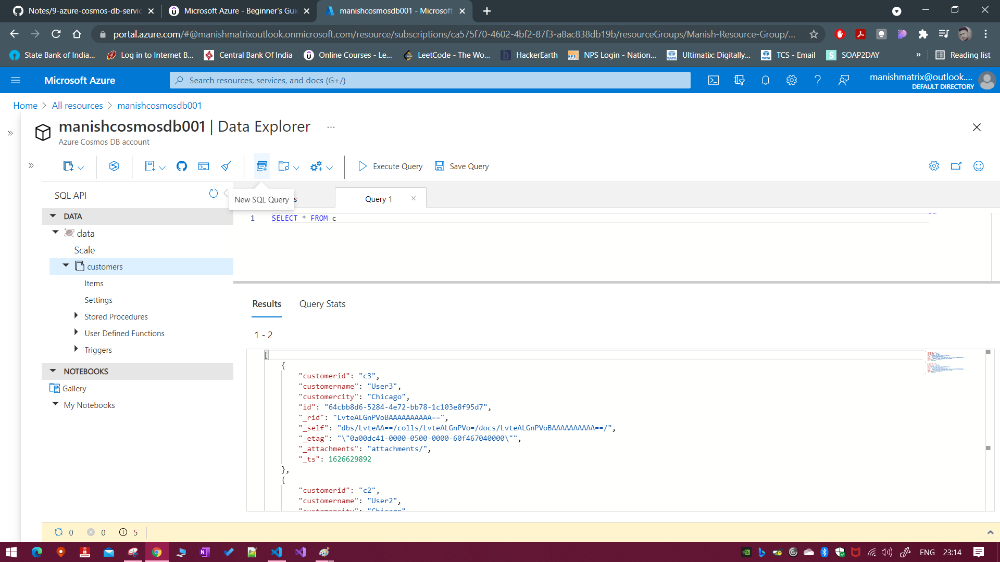

# Azure Cosmos DB Service

## What is NoSQL database and Why it was needed

Relational databases have normalization, which prevents the duplication of data. In the beginning disk space used to be a very big constraints for commerical application, but now not so much.

One of the main reasons for normalization was to reduce the duplication of data.
But with the demand for flexibility of data, simpler database system where the data schema can vary for each row, and we are not worried about joins.

NoSQL database = Non-relational database

## Azure Cosmos DB

- This is a fully managed NoSQL database
- latency access to your data
- There are also different API's available with Azure Cosmos DB
- These different API's allow you to store data in different formats

  > SQL API: here the data can be stored in JSON based documents and can be queried using SQL like commands

  > Table API: Store data in simple tables

  > MongoDB API: MongoDB is a document based database. If you have an existing MongoDB database in place and if you want to migrate to Azure, you can consider consmos DB

  > Cassandra API: This is a column based database

  > Gremlin API: This is a graph-based database.

## creating an Cosmos DB account

Search for Azure Cosmos DB -> give usinque account name -> Select the type of API (as discussed in above section) -> here, you are not charged for te CPU, but you are charged for storage and input/output (Requests units per second) -> review and create

You can create container (as databases) to store JSON documents. You may need to create a partition key which help cosmos DB partition your data to make searching easier. we will learn more about this in Azure developer course.

Note: ID (created automatically by cosmos db) and partition key (created by us) help to identify a particular record within a container in Cosmos DB.

Example data in Azure Cosmos DB:

```json
{
    "customerid":"c1",
    "customername": "User1",
    "customercity": "New York"
}
{
    "customerid":"c2",
    "customername": "User2",
    "customercity": "Chicago"
}
{
    "customerid":"c3",
    "customername": "User3",
    "customercity": "Chicago"
}
```

## Working with Cosmos DB (SQL API)

Use `Data Explorer` to work with Cosmos DB
Free Account: **400 Request units/sec(minimum)**, 25 GB free
We create containers. make sure to select mannual to save costs




Click on `New Item` to enter new item or JSON entry for a customer, please refer below:


Hit save to enter the data into the db


See how the highlighted part is autogenerated by the cosmos db

Please refer below on how to run the sql command in cosmos db

